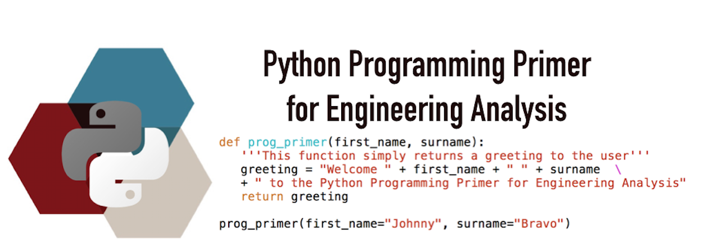

 
 
Material for the Programming in Python primer for incoming Engineering
Analysis students in MENG 26030 (Fall of 2018) to be held for three mornings the
week prior to the start of the fall quarter. The primer intends to expose incoming
engineering analsysis students with basic programming concepts using the python
language to better prepare them for the analysis work to be covered in the 
fall quarter course. 

* Date: Sep 25 - Sep 27
* Time: 9:00 am - 12:00 pm
* On-Site Location: Kersten KPTC 101  
* Instructors: Mark Stoykovich & Jonathan Skone
* Canvas Link: [MENG 26030](https://canvas.uchicago.edu/courses/17437)
* Slack Link: [ime-ppp Slack workspace](https://join.slack.com/t/ime-ppp/shared_invite/enQtNDQxMTc2MzkzMDU3LWExOTA0MjBjZDcwOTI5Yjc1ODM4YjdiMWM2NTIxMzVmOGI4YzRkYjRhYTJjMDMxNDg1OTcxZjhhODVlMzc5OTU)
* Syllabus: [ime-ppp syllabus](docs/ime-ppp-syllabus.pdf)

## Schedule:
### Day 1 (Tuesday September 25)
* [Day 1 Topics:](#day-1)
  * Git & Jupyter Lab basics
  * Data Structures in Python
  * Manipulating Lists and Arrays
  * Loops and Control Flow
 
### Day 2 (Wednesday September 26)
* Review of Day 1 
* [Day 2 Topics:](#day-2)
  * Functions
  * File I/O
  * Plotting and Visualization 

### Day 3 (Thursday September 27)
* Review of Day 2 
* [Day 3 Topics:](#day-3)
  * Structuring a Program
  * More Examples With numpy
  * Other Scientific Libraries

## Running the Collection of Tutorials

There are no installation requirements for your local computer in order to view 
and run any of the ipython notebooks used in this short course. Instead we will 
rely on cloud compute resources that you will connect to through your web browser.
In order to access an interactive environment to view and execute the python 
programming jupyter notebooks, you will need to click the *binder* link at the top
left of this section. This will open up a new browser window tab that will provision 
a lightweight remote cloud resource that will spin up a jupyter notebook server 
for you to interactively work with the notebooks and other content of this repo. 

## Using Python on Your Personal Computer

Most of your personal computers will come with python 2.7 already installed, but 
to take full advantage of newer features and keep yourself contemporary, you'll 
need to upgrade yourself to at least version 3.5 of python. The end-of-life for 
the 3.5 version of python (i.e. the time at which no further updates or patches 
will be released is 09,13,2020). For reference the newest stable release 3.x version
of python (3.7) has an end-of-life scheduled for 06,27,2023.

### Installing Anaconda Python
**Note:** *You do not need to install anything to view and execute the examples 
for this three day workshop. The installation instructions provided here are for 
you to be able to run python on your own personal resource if you wish to in the 
future.*

There are several ways in which one can go about installing or upgrading python
on their system. The [python software foundation](https://www.python.org/) is responsible for managing and 
distributing various releases of python. You could directly download from their 
site a version of python for your particular OS, but this is is not the recommended
way of upgrading yourself. You could also use a package manager if using linux 
(yum, apt-get, etc.) or a mac (home brew, mac ports, etc.) to system install 
python, but again this is not the easiest solution, requires root access on the
machine, and furthermore can complicate your managment of python on your system. 

The simplest and recommended solution is for you to install the Anaconda 
distribution of python.  
 

Why Anaconda?... 
The Anaconda distribution of python comes prepackaged with most of the python 
packages you would want to use for scientific computing, like numpy, matplotlib, 
scipy, and jupyter notebook server/lab. Furthermore it comes packaged with 
Intel's MKL math libraries that the numpy and scipy functions link against, 
providing you with faster linear algebra under the hood without any additional 
effort on your part to configure this. 

Follow the [Anaconda Python Installation Instructions](https://docs.anaconda.com/anaconda/install/)
provided on the Continuum Analytics site for your particular operating system. 
Download a 3.x version (either the latest or a version no older than 3.5). Do not
install the miniconda version as this does not come with any of the scientific 
packages preinstalled or the fast math libraries. 

